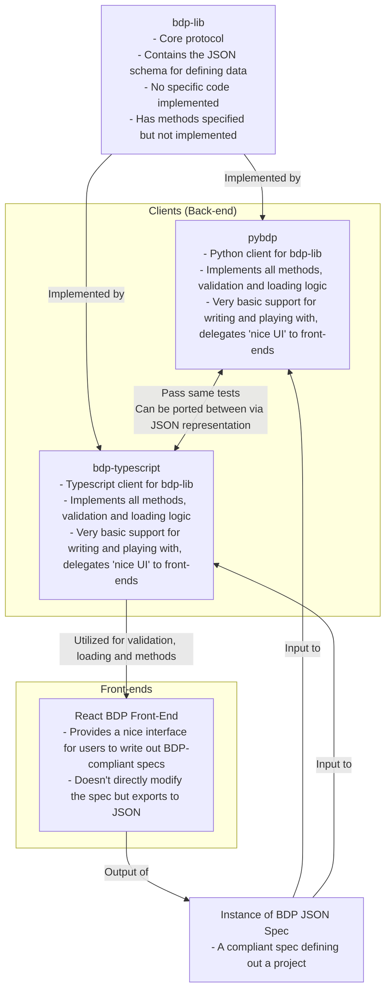
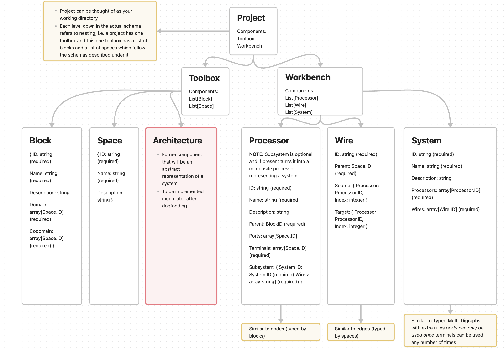

# BDP Economics Pod Presentation

## Agenda

1. BDP Introduction
2. Canonical Example Walkthrough
3. Discussion Time

## BDP Introduction

The block diagram protocol defines a schema for data that represents a block diagram as well as functionality for these block diagrams.

### Why bdp-lib?

- **Standardization**: The json schema provides a standardized way to define a block diagram
- **Interoperability**: The protocol can be used to communicate through different clients that may enhance the base schema or use it as-is
- **Open Source Software Implementations**: The bdp-lib has open source software implementations which handle a variety of use cases

### Functional Requirements

1. The library provides a schema for defining out the elements of a basic block diagram.
2. The library can be extended with two primitive functionalities:

    A. Modifying - Support for basic zooming, tearing and linking functions while not breaking validity rules

    B. Enriching - Attatching further enhancements such as types, units, semantic labels, etc.
3. The library performs validation for the following constraints:

    A. All inputs follow the schemas supplied

    B. All references (through IDs) are present

    C. All ports/domains have one and only one input

    D. [Optional] All blocks are connected to at least one other block

### BDP in the Engineering Lifecycle

- BDP is meant to enhance early scaffolding of systems in a way that users can build out baseline scaffolds of what the system will look like before going into detail
- In the past, manually drawing block diagrams was the norm, but bdp allows programmatic drawing of block diagrams as well as validations to be run
- BDP is also meant to be the precursor to an MSML and eventually cadCAD model whereby after scaffolding with block diagrams one can extend functionality and detail with MSML

### Implementations

### Schema Diagram

### More Resources

- For more information on bdp-lib, the website [here](https://blockscience.github.io/bdp-lib/) provides detailed documentation
- We will quickly walk through the site now for awareness

## Canonical Example Walkthrough

- Now we walk through a canonical example from [BDP-ML](https://github.com/BlockScience/BDP-ML/tree/main).

## Discussion Time

- Time is reserved for any discussions, with the following prompts for thought:
    - What would make this more powerful for any use cases one might imagine?
    - Is there anything that is not clear?
    - Where might we also think of testing this out?
    - Is anything missing?