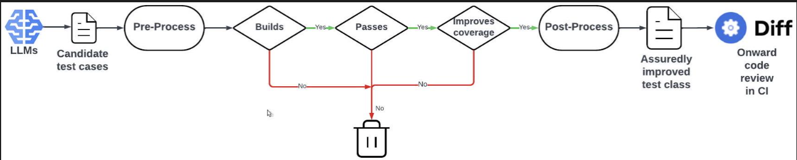

# AI for BDP

## Executive Summary

This research note is on the idea of using AI to translate information into block diagram protocol objects automatically.

## TestGen-LLM Review

- Literature review with the [paper on TestGen-LLM](https://arxiv.org/abs/2402.09171) provided a starting point for how to build out the apparatus for building and testing this idea

### Offline LLMSE

- "That is, unlike other LLM-based code and test generation techniques, TestGen-LLM uses Assured Offline LLMSE to embed the language models, as a service, in a larger Software Engineering workflow that ultimately recommends fully formed software improvements rather than smaller code snippets. These fully-formed code improvements are backed by verifiable guarantees for improvement and non-regression of existing behavior. A filtration process discards any test case that cannot be guaranteed to meet the assurances."
- The paper points to the benefits of crafting an offline LLM for use in this flow
- This paper was focused on a similar but slightly different goal of increasing test case coverage: "As part of our overall mission to automate Unit Test generation for Android code, we have developed an automated test class improver, TestGen-LLM. TestGen-LLM uses two of Meta's ${ }^{1}$ Large Language Models (LLMs) to extend existing, human-written, Kotlin test classes by generating additional test cases that cover previously missed corner cases, and that increase overall test coverage. TestGen-LLM is an example of Assured Offline LLM-Based Software Engineering (Assured Offline LLMSE) [6]."

### Infrastructure Use Cases

- "However, the same infrastructure can also be used as a kind of ensemble learning approach to find test class improvement recommendations. TestGenLLM thus has two use cases:
(1) Evaluation: To evaluate the effects of different LLMs, prompting strategies, and hyper-parameters on the automatically measurable and verifiable improvements they make to existing code.
(2) Deployment: To fully automate human-independent test class improvement, using a collection of LLMs, prompting strategies, and hyper-parameters to automatically produce code improvement recommendations that are backed by"
- **We also likely want to think about the problem in the same way - both improving our methodology (point 1) and also deploying for use (point 2)**
- "The evaluation mode was used as a prelude to deployment, allowing us to investigate and tune such choices of LLM, prompt strategy and temperature. It was also used after initial deployment to tune parameters for the subsequent, more widespread, release of the tool to engineers at Meta."

### Methodology

- "TestGen-LLM achieves the assurances it offers to code reviewers by applying a series of progressively demanding semantic filters to candidate solutions generated by the language models."
- The figure below from the paper depicts the methodology:

- "Any code that does not build is immediately discarded and thereby removed from further consideration."
    - This is similar to automatically discarding/failing any code which does not compile given bdp-lib restrictions
- "Different LLMs have different strengths. Even the same LLM can produce multiple candidate solutions for a given prompt. As our results show, although some prompts, parameters and underlying LLM technologies perform better than others for a given test class, each combination tends to contribute uniquely to the overall number of test cases found (See Section 3.3). It is therefore highly advantageous to formulate the problem in such a way that it is amenable to an ensemble-style learning approach [11]. In such an ensemble approach, the best aspects of many LLMs, their prompts and parameters, can also be combined to give an overall improvement recommendation."
    - Ensemble methods may prove worth investigating for our purposes
- "The LLM produces code components, not entire programs. Components are composable, and therefore can be provided by multiple different LLMs, working as an ensemble. For the test improvement instance of Assured LLMSE, each component is a test case. Test cases compose very naturally to form test classes and test suites."
    - We likely also want to do it in smaller pieces
- The paper makes clear that this is not a replacement for software engineers but rather a recommendation system

### Deployment

- "The deployment workflow thus follows a gradual incremental deployment plan, in which the MVP is gradually evolved and matured from proof of concept to deployed tool/infrastructure, over a series of increasingly larger-scale, and increasingly less tightly constrained trials."
    - Likewise we can start with tightly constrained trials and move on to larger-scale ones
- One avenue of feedback was during a test-a-thon where engineers took a week to build out tests

## Application to AI for BDP

### Overall Objectives

- Taking the ideaology of this as a recommender system for engineers rather than a replacement similar to the paper is key
- This further raises the question of whether we want the AI to produce multiple options for potential implementation
- Following a similar deployment of being with tightly constrained trials and moving outwards into larger scale experiments is the right direction

### Filtering System

- Similar to the paper, we can adopt a filtering system that fails at different stages if:
    - The JSON code is not written correctly
    - Any of the JSON does not pass the JSON validation of bdp-lib
    - After validation if the project does not load because of errors like multiple inputs into the same port for a system
    - Final human evaluation for correctness
        - This may be better formulated as a score of how accurate the model is
- Likely we want a pipeline formulated in a similar way to the figure presented where we have LLMs produce the data then filter in batches

### LLM Creation

- An offline LLM would be ideal but might be better taken care of in the future
- Ensemble LLMs are a possible extension to use similar to the paper
- Following the dual purpose methodology of evaluation then deployment followed by the paper makes sense
- Based on the paper and personal bias, it makes sense to consider as atomic of components as possible, especially with relation to ensemble learning

### Deployment

- Begin small with component only tests
- Consider something similar to a "test-a-thon" for rapidly getting feedback

## Possible Next Steps

1. Scaffold an architecture
2. Discuss whether the ouput should be a single best option or multiple options in relation to the idea of the AI as a recommender system