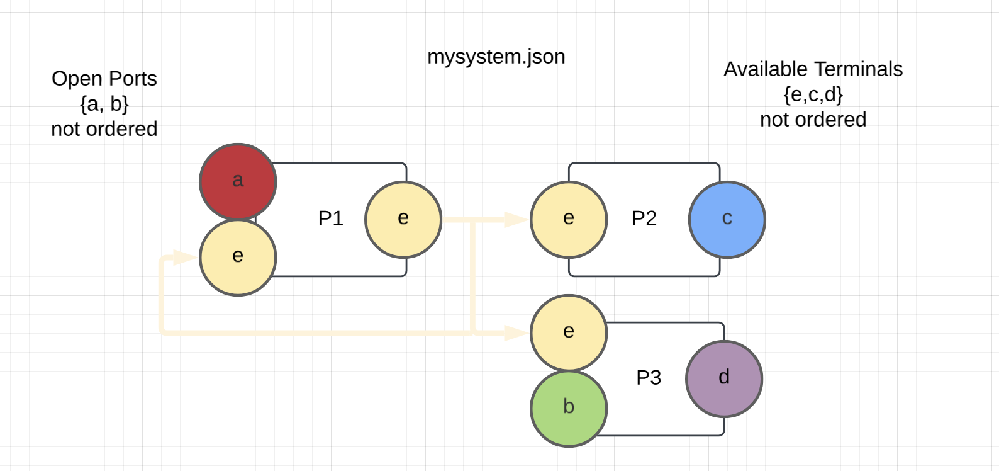
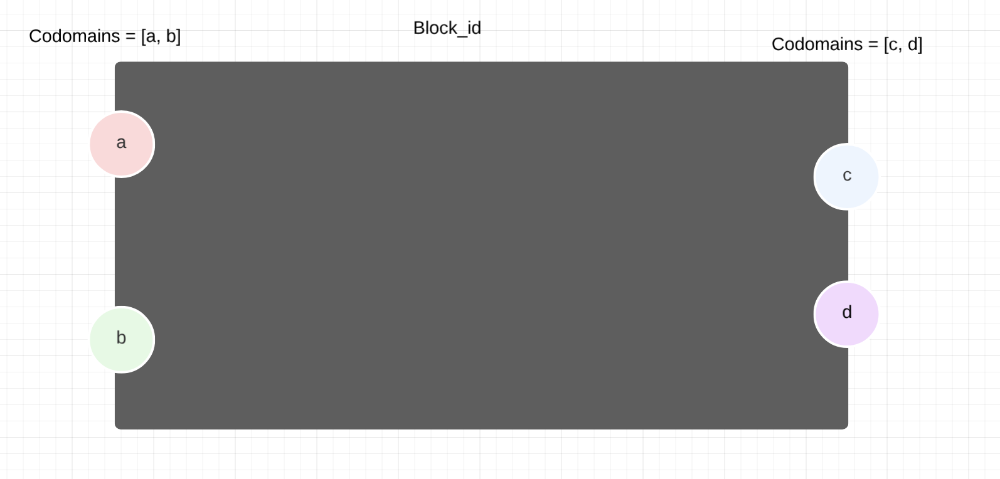
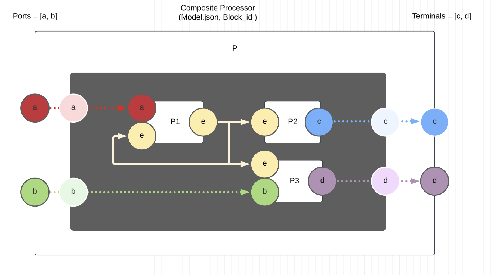
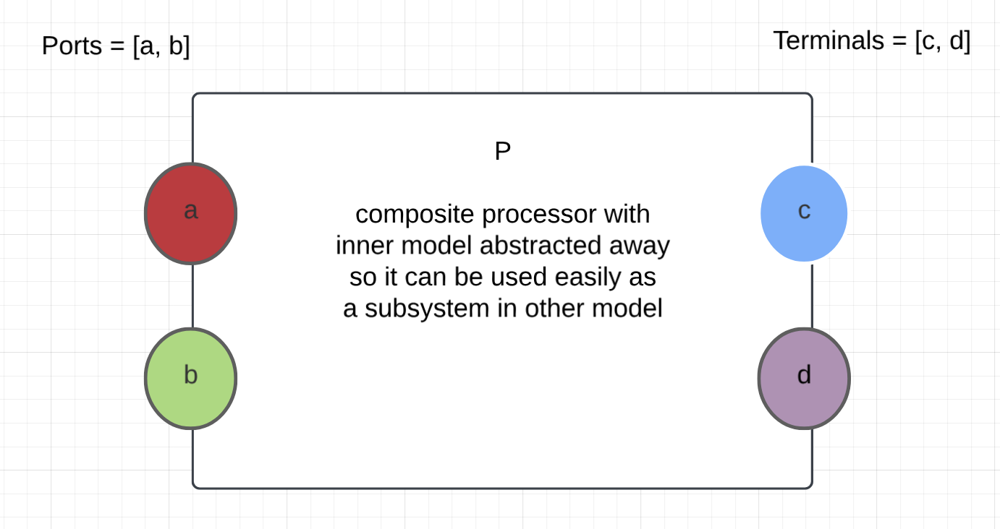

# Processor

A processor is an instance of a block that interacts within the system based on its structure. Beyond a basic processor there is also a special case of the composite processor which functions as a processor which represents an actual system, allowing for composability. This idea is explained in the composite processor section.

## Schema

```
object {
    ID: string (required)
    Name: string (required)
    Description: string
    Parent: string (required)
    Ports: array[string]
    Terminals: array[string] (required)
    Subsystem: object {
      System ID: string (required)
      Wires: array[string] (required)
    }
  }
```

- Parent should reference an ID of a block which is the abstract class this processor implements
- Ports and terminals should be arrays of strings which match up to IDs that spaces have
- If the processor is a composite process, the system ID should be an ID of one of the systems in the toolbox and the wires attribute should be an array of strings which are IDs for different wires in the toolbox

## Composite Processor

Sometimes a processor is meant to represent an actual system if you zoomed it out a level. We will work through the idea of composite processor here with an example. Let's begin with a system that we might have defined in our toolbox which looks like the following:



We can notice a few things:

- This is a directed graph
- We see that there are two open ports and three possible terminals (remember that a terminal can be used more than once!)
    - If we were to look for open terminals, it would only be C and D

This system can be represented with any block so long as the domain only uses elements of A and B, and the codomain only uses elements of C, D, E. For example, the block below could possibly satisfy this.



In order for this to work, however, there has to be a mapping (with wires) of all the ports and terminals to interior processors. The following would be the visual representation.



The view above is one way to look at the composite processor, but the idea is that if you want you can go between this representation and the representation of it as a simple process like below.

