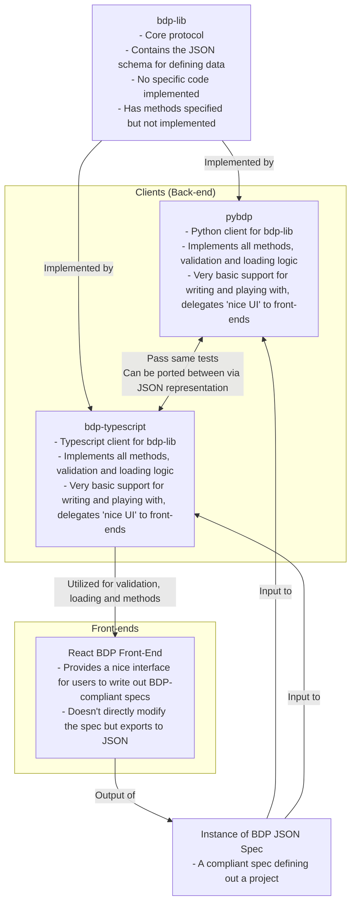

# Block Diagram Protocol Library

The block diagram protocol defines a schema for data that represents a block diagram as well as functionality for these block diagrams.

## Why bdp-lib?

- **Standardization**: The json schema provides a standardized way to define a block diagram
- **Interoperability**: The protocol can be used to communicate through different clients that may enhance the base schema or use it as-is
- **Open Source Software Implementations**: The bdp-lib has open source software implementations which handle a variety of use cases

## Functional Requirements

1. The library provides a schema for defining out the elements of a basic block diagram.
2. The library can be extended with two primitive functionalities:

    A. Modifying - Support for basic zooming, tearing and linking functions while not breaking validity rules

    B. Enriching - Attatching further enhancements such as types, units, semantic labels, etc.
3. The library performs validation for the following constraints:

    A. All inputs follow the schemas supplied

    B. All references (through IDs) are present

    C. All ports/domains have one and only one input

    D. [Optional] All blocks are connected to at least one other block

## Conceptual Framework

The conceptual framework distinguishes abstract patterns that we reuse from concrete components which satisfy those patterns. The abstract patterns tell us how things can be wired together but they cannot themselves be wired, only their concrete counterparts can be wired. By preserving these seperation we can identify and take advantage of stuctural similarities in the systems we're modeling.

The following table categorizes components into **abstract vs. concrete** and **structural vs. behavioral** dimensions:

|               | Abstract  | Concrete  |
|--------------|-----------|-----------|
| **Structure** | Space     | Wire      |
| **Behavior**  | Block     | Processor |

This classification provides a clear distinction between the elements of the system:

- **Abstract Structure (Space)**: Represents the conceptual spaces through which data, signals, or states flow.
- **Abstract Behavior (Block)**: Defines reusable templates describing how components behave in a system.
- **Concrete Structure (Wire)**: Connects instantiated components (processors) according to defined spaces.
- **Concrete Behavior (Processor)**: An instance of a block that interacts within the system based on its structure.

In summary, **spaces and blocks define the abstract model**, while **wires and processors bring it into concrete implementation** through instantiation and connectivity.

## Protocol vs. Clients

An important distinction is that this repository defines the **protocol** which different **clients** can utilize. Found in the documentation is the json data schema which needs to stay the same for interoperability as well as the functionality and rules that an implementation should have. This distinction is important because the separation ensures that many views on block diagrams can be created in many languages but they will all satisfy the same basic requirements and formalisms.

The bdp-lib schema is purposely verbose with regards to things such as requiring declaring of the space for a wire. This attribute could very well be implied given the port and terminal have to have the matching space, but if one wants to remove it they can simply create the UX on a client which hides this part and auto-fills it.

As well, there can be many output types from different clients and the protocol makes no restrictions on this. Outputted diagrams could be made with mermaid.js or with graphviz, but that is left up to client implementations. The following is an overview of the boundaries between implementations and the protocols:

